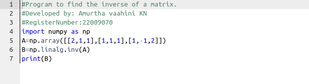

# INVERSE-OF-A-MATRIX
## Aim:
To write a python program to find the inverse of a matrix
## Equipment’s required:
1. 	Hardware – PCs
2. 	Anaconda – Python 3.7 Installation / Moodle-Code Runner
## Algorithm:
### Step1 :
 import math operations
### Step 2:
 make operations in the given matrix
### Step 3: 
Using the np.linalg.solve(), we can find the solutions
### Step 4: 
end the program
## Program:
```python
#Program to find the inverse of a matrix.
#Developed by: Amurtha vaahini KN
#RegisterNumber:22009070
import numpy as np
A=np.array([[2,1,1],[1,1,1],[1,-1,2]])
B=np.linalg.inv(A)
print(B)
```
## Output:

## Result:
Thus the inverse of given matrix is successfully solved using python program

